# IImperialism! Manual

Version: 0.1.0

Author: Taciano Dreckmann Perez

## INTRODUCTION

In IImperialism!, you rule an industrializing empire in a nineteenth-century-inspired age of trade, diplomacy, and naval rivalry. Your task is to build a functioning economy, keep your treasury solvent, win favor abroad, and secure enough support in the Council of Nations to claim victory.

This is a turn-based game. Each turn, you review your empire, adjust standing orders, send trade expeditions, invest in research, and then end the turn so your economy can operate.

## STARTING A GAME

Boot your Apple II with the IImperialism! floppy and wait for the splash screen. Press `ESC` to continue. You will then be asked to enter the name of your nation. Type a name of up to ten characters and press `RETURN`.

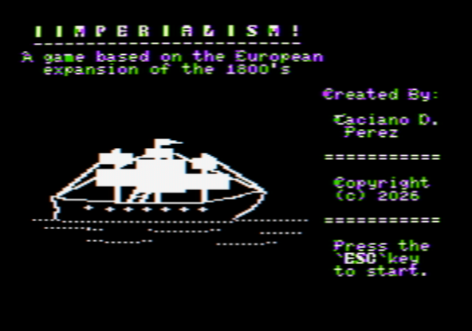

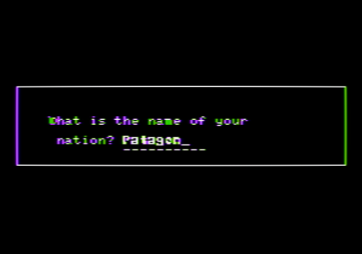

The game begins on the Main Screen.

## HOW THE GAME WORKS

Your empire runs on four connected systems:

- Transport brings raw materials from your provinces into the warehouse each turn.
- Production converts those materials into processed and finished goods.
- Trade expeditions buy and sell goods abroad for profit and improve foreign relations.
- Science improves the efficiency of your provinces, fleet, and navy.

The basic economic chain is:

- Timber -> Lumber -> Furniture
- Wool -> Fabric -> Clothes
- Iron + Coal -> Steel -> Tools or Guns

You start with a small stockpile, a limited labor force, a wagon network, a merchant fleet, and a navy. The game is won through diplomacy rather than conquest: every ten turns, the Council of Nations meets and votes. If your nation controls 24 votes, you win the game.

## TURN SEQUENCE

During your turn, you may visit the different ministries and screens in any order. When you press `E` on the Main Screen, the turn ends and the following happens:

1. Your transport orders move raw materials from the provinces into your warehouse.
2. Your production orders consume inputs and produce goods.
3. Market prices are refreshed in foreign nations and are influenced by your current relations with them.
4. Upkeep is deducted from your treasury.
5. Relations with non-allied nations slowly decline.
6. The turn number advances.
7. Every tenth turn, the Council of Nations convenes.

Transport and production orders remain in effect from turn to turn until you change them.

## THE MAIN SCREEN

The Main Screen is your central command screen. It shows your nation name, the current turn, your funds, and an advisor prompt.

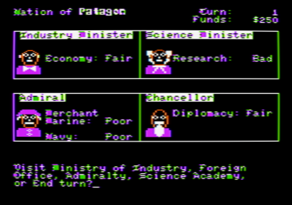

From here, press:

- `I` for the Ministry of Industry
- `P` for the Patent Office
- `A` for Admiralty Headquarters
- `F` for the Foreign Office
- `E` to end the turn
- `ESC` to open the Game Menu

## THE GAME MENU

Press `ESC` from the Main Screen to open the Game Menu.

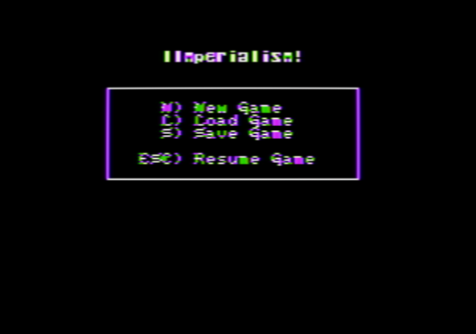

From the Game Menu, press:

- `N` to start a New Game
- `L` to Load Game
- `S` to Save Game
- `ESC` to resume the current game

## THE MINISTRY OF INDUSTRY

The Ministry of Industry summarizes the state of your domestic economy.

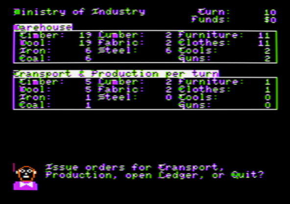

The top warehouse panel shows your current stock of:

- Raw materials: Timber, Wool, Iron, Coal
- Processed goods: Lumber, Fabric, Steel
- Finished goods: Furniture, Clothes, Tools, Guns

The lower panel shows:

- Current transport orders per turn for Timber, Wool, Iron, and Coal
- Current production orders per turn for all manufactured goods

From this screen, press:

- `T` for Transport Orders
- `P` for Production Orders
- `L` to open the Ledger
- `Q` to return to the Main Screen

## TRANSPORT ORDERS

Transport Orders determine how much raw material reaches your warehouse each turn.

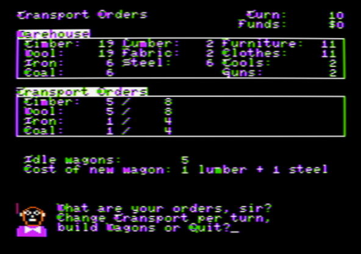

Your provinces produce fixed amounts of:

- Timber
- Wool
- Iron
- Coal

Wagons are required to move those materials. Each assigned unit of transport uses wagon capacity. Idle wagons are shown on screen.

From the Transport screen, press:

- `T` to change transport orders
- `B` to build more wagons
- `Q` to return to the Ministry of Industry

When changing orders, choose `T`imber, `W`ool, `I`ron, or `C`oal, then enter the new amount to transport each turn.

When building wagons:

- Each wagon costs 1 Lumber and 1 Steel.

Transport is limited by:

- The province yield of that resource
- Your currently available wagons

If you assign more wagons to one resource, fewer remain available for the others.

## PRODUCTION ORDERS

Production Orders control your factories and workshops. Each unit of production also requires one worker assigned to that order.

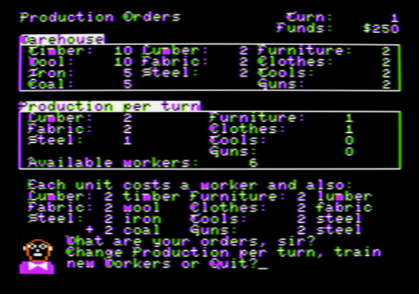

From the Production screen, press:

- `P` to change production orders
- `T` to train new workers
- `Q` to return to the Ministry of Industry

Production recipes are:

- 1 Lumber requires 2 Timber
- 1 Fabric requires 2 Wool
- 1 Steel requires 2 Iron and 2 Coal
- 1 Furniture requires 2 Lumber
- 1 Clothes requires 2 Fabric
- 1 Tools requires 2 Steel
- 1 Guns requires 2 Steel

To change production orders, choose:

- `L` for Lumber
- `F` for Fabric
- `S` for Steel
- `U` for fUrniture
- `C` for Clothes
- `T` for Tools
- `G` for Guns
- `Q` to quit the order-entry prompt

Enter the new number of units to produce each turn. The game will limit you by available inputs and available workers.

## TRAINING WORKERS

Workers are required for both production and shipbuilding.

From the Production screen, press `T` to train workers.

Each new worker costs:

- 1 Furniture
- 1 Clothes

Training raises your available labor pool, allowing larger production orders and more shipbuilding.

## THE LEDGER

The Ledger shows the financial result of the current turn so far.

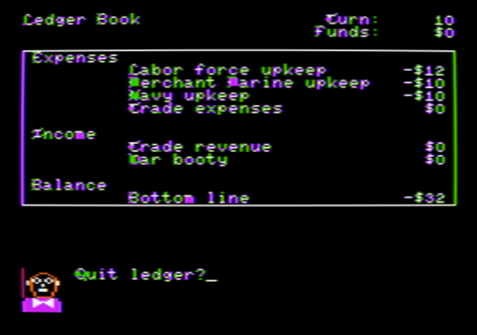

It lists:

- Labor force upkeep
- Merchant marine upkeep
- Navy upkeep
- Trade expenses
- Trade revenue
- War booty
- Bottom-line balance

Use this screen to judge whether your empire can afford its current military, labor force, and trading activity.

Press any key to close the Ledger and return to the Ministry of Industry.

## ADMIRALTY HEADQUARTERS

The Admiralty manages both your merchant fleet and your war fleet.

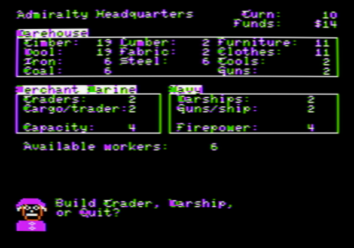

The screen shows:

- Number of Traders
- Cargo capacity per trader
- Total merchant capacity
- Number of Warships
- Guns per warship
- Total naval firepower
- Available workers

From this screen, press:

- `T` to build Trading vessels
- `W` to build Warships
- `Q` to return to the Main Screen

Base costs are:

- Trader: 1 Lumber, 1 Fabric, and 1 Worker
- Warship: 1 Lumber, 1 Fabric, 1 Gun, and 1 Worker

Science upgrades can raise these costs for newly built ships:

- At 2x trader capacity, a new Trader costs 2 Lumber, 2 Fabric, and 1 Worker.
- At 4x trader capacity, a new Trader costs 4 Lumber, 4 Fabric, and 1 Worker.
- At 2x guns per warship, a new Warship costs 1 Lumber, 1 Fabric, 2 Guns, and 1 Worker.
- At 4x guns per warship, a new Warship costs 1 Lumber, 1 Fabric, 4 Guns, and 1 Worker.

Traders determine how much cargo you can carry on trade expeditions. Warships protect those expeditions and provide strength in battle.

## THE PATENT OFFICE

The Patent Office is the science screen. Here you invest money to patent new technologies.

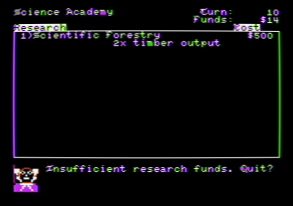

From this screen, press:

- `R` to invest in research
- `Q` to return to the Main Screen

Only the next technology in sequence may be researched. The cost is:

- Technology level x $1000

The current research ladder is:

1. Forestry: 2x Timber output
2. Sheep Breeding: 2x Wool output
3. Carronade: 2x guns per warship
4. Shaft Mining: 2x Iron output
5. Clipper Ships: 2x trader capacity
6. Coal Pumps: 2x Coal output
7. Shell Guns: 4x guns per warship
8. Steel Hulls: 4x trader capacity

The direct gameplay upgrades are:

- Forestry, Sheep Breeding, Shaft Mining, and Coal Pumps increase raw-material output from provinces
- Carronade and Shell guns increase guns per warship and proportionally increase the Gun cost of new warships
- Clipper Ships and Steel Hulls increase trader capacity and proportionally increase the Lumber and Fabric cost of new traders

Research is expensive, but these upgrades can greatly improve your industry, trade capacity, and naval combat power.

## THE FOREIGN OFFICE

The Foreign Office is the diplomacy screen. It lists five foreign nations, their current status toward you, and the goods they export and import.

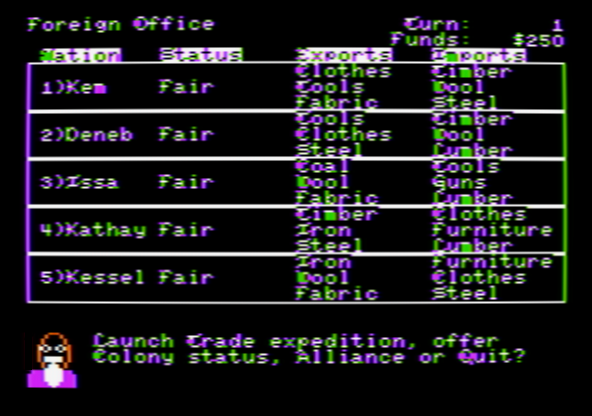

Relations are displayed as:

- Bad
- Poor
- Fair
- Good
- Great
- Ally (Great Power) or Colony (minor nation)

Arrows to the right of this field indicate if the relations status with a nation are trending up or down.

The first two nations are the other Great Powers. The remaining three are minor nations. Great Powers import raw materials and export processed goods, whereas minor nations export raw materials and import processed goods. Great Powers can become allies, and minor nations can be turned into colonies.

From this screen, press:

- `T` to launch a Trade Expedition
- `A` to offer an Alliance
- `C` to offer Colony status
- `Q` to return to the Main Screen

Trade and diplomacy are the main ways to improve your standing abroad and earn Council votes later in the game.

## ALLIANCES AND COLONIES

Formal diplomacy is expensive and only becomes available when relations are already strong.

Each diplomatic mission costs:

- $1000

Rules:

- Alliances may be offered only to Great Powers.
- Colony status may be offered only to minor nations.
- The target nation must have `Great` status toward you.
- Acceptance is not guaranteed.

If the offer succeeds:

- A Great Power becomes an Ally.
- A minor nation becomes a Colony.

Once the offer is accepted, the relationship becomes permanent, not degrading over time.

These special relationships are important because allied or colonial nations vote for you in the Council of Nations.

## TRADE EXPEDITIONS

Trade expeditions are the heart of the game. They are how you turn goods into money and improve relations.

From the Foreign Office, press `T`, choose a nation from `1` to `5`, and sail. You must have at least one warship to attempt a trade expedition.

There is always a risk of battle at sea:

- Pirates may attack.
- A hostile foreign power may also attack, provided that its relations with you are bad.

Either if no battle occurs or when you are victorious, you reach the foreign market. If you are defeated, you return to your home port.

## THE FOREIGN MARKET SCREEN

When a trade expedition arrives, the market screen shows:

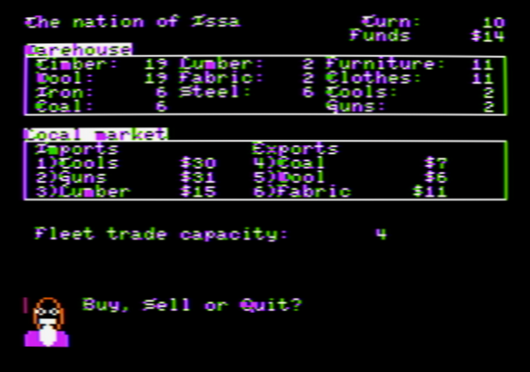

- The foreign nation you are visiting
- Your current warehouse
- That nation's local market prices
- Goods they will import from you
- Goods they will export to you
- Your remaining fleet capacity for the turn

Those market prices depend in part on relations: nations that like you offer better terms than nations that do not.

Each expedition uses your merchant fleet's carrying capacity. That capacity is shared across all trading you do in the same turn.

## BUYING AND SELLING

At the market, press:

- `B` to Buy
- `S` to Sell
- `Q` to leave and return to the Foreign Office

When buying:

- You buy from the nation's exports.
- The maximum you can buy is limited by your money and remaining cargo capacity.

When selling:

- You sell goods the nation imports.
- The maximum you can sell is limited by your warehouse stock and remaining cargo capacity.

Each unit traded uses one point of cargo capacity.

Successful trade also improves relations with that nation, making future diplomacy easier and helping secure Council votes.

## BATTLE AT SEA

Battles occur when a trade expedition is intercepted.

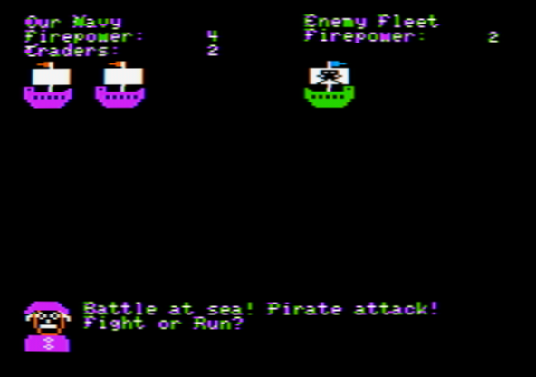

The battle screen shows:

- Your navy's firepower
- Enemy fleet firepower
- Your remaining traders

During battle, press:

- `F` to Fight
- `R` to Run

If you fight and win:

- You receive war booty in cash.
- The expedition continues to the trade screen.

If you lose warships in battle:

- Your warship total falls.

If traders are hit:

- Your trader total falls as well.

If you run:

- You may still lose a trader.
- The expedition ends and you return to your home port.

Battles are dangerous, but victory can be profitable.

## THE COUNCIL OF NATIONS

Every ten turns, the Council of Nations meets.

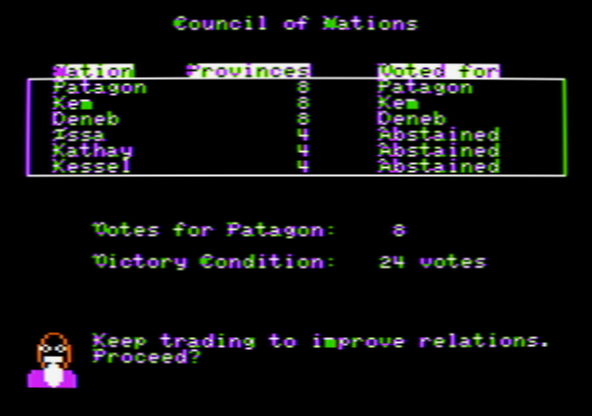

The council shows:

- Each nation's province total
- Who that nation voted for
- Your current vote total
- The victory target

Vote strength is based on provinces:

- The three major nations have 8 votes each
- The three minor nations have 4 votes each

To win the game, your nation must reach:

- 24 votes

Your own nation always votes for itself. Allied Great Powers and colonial minor nations will also vote for you. If you have not yet secured enough support, the game continues after the council session.

If you do secure enough support, the Council first confirms the victory and then shows the final report to the crown.

## STRATEGY GUIDE

A reliable opening plan is:

1. Stabilize transport so you are bringing in enough Timber, Wool, Iron, and Coal every turn.
2. Expand production of Lumber, Fabric, and Steel before pushing too hard into finished goods.
3. Train workers when your factories or shipyards are constrained by labor.
4. Build traders so you can move more cargo, and maintain warships so expeditions are possible.
5. Trade actively with the same nations to improve relations and improve future market prices.
6. Spend diplomatic missions on nations that have already reached `Great` status.

General advice:

- Do not ignore upkeep. A large fleet and workforce can bankrupt you.
- Tools and Guns are advanced goods, but you must first sustain Steel production.
- Trade capacity is precious. Buy and sell only what gives useful profits or supports your production chain.
- Advanced traders and warships are stronger, but their shipyard costs rise with their science bonuses.
- Research that improves raw-material output, trader capacity, and naval guns has a large long-term payoff.
- A colony or alliance is often worth more than a short-term trade gain because it helps secure Council votes.

## VICTORY

IImperialism! is won in diplomacy, backed by industry and trade.

Build a strong economy, keep the sea lanes open, turn commerce into influence, and enter the Council of Nations with enough allies and colonies to command 24 votes.

After victory, the game presents a final score and historical rating. The score rewards three things:

- diplomacy beyond the bare 24-vote victory
- speed of victory
- treasury

The final report may still list your fleet, firepower, and merchant capacity as
part of the campaign summary, but those values no longer add directly to the
final score.

The final report shows `Your score is ...` in inverted text, then compares your campaign to a rank ladder of nineteenth-century European heads of state:

- Queen Victoria: `50,000 and over`
- Otto von Bismarck: `35,000 to 49,999`
- Napoleon III: `20,000 to 34,999`
- Charles X: `8,000 to 19,999`
- Ferdinand VII: `less than 8,000`

## INSPIRATION AND AUTHORSHIP

IImperialism! is a love letter to the classic games <b>Taipan!</b> (Apple II) and <b>Imperialism</b> (PC and Mac). Some of its visual and textual elements are borrowed from these great games.

IImperialism! has been created by Taciano Dreckmann Perez in 2026. All rights reserved.

